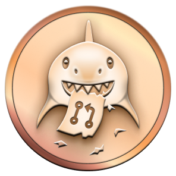
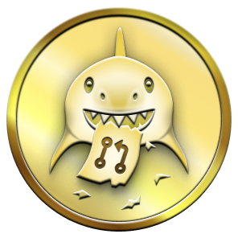
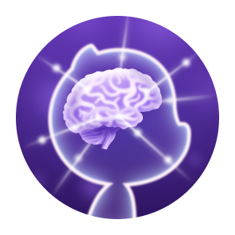

# הישגים בגיטהאב: למה, כמה ואיך

מדריך בעברית להישגים (Achievements) ולתגיות בפרופיל GitHub: מה הם מציינים, איך מקבלים אותם ואילו תמונות שמורות במאגר.

## מה הם הישגים?

הישגים הם תגיות ש-GitHub מציגה בפרופיל בעקבות פעולות מסוימות בפלטפורמה, כמו מיזוג Pull Request, תרומה לדיון או קבלת כוכבים למאגר. לחלק מההישגים יש כמה דרגות.

הם נועדו לציין פעילות והשתתפות בקהילה. הם אינם מדד מלא לאיכות הקוד או לניסיון מקצועי, ואינם מבטיחים ש-Pull Request יתקבל מהר יותר או שמועמדות לעבודה תצליח.

ההישגים מוצגים בפרופיל כברירת מחדל, ואפשר לשנות את הגדרות התצוגה דרך [הגדרות הפרופיל](https://github.com/settings).

## סוגי הישגים

הקריטריונים להלן הם תיאור כללי. GitHub עשויה לשנות את תנאי הזכאות, וחלק מהפרטים אינם מפורסמים במקור. מומלץ לבדוק את [המקור הקהילתי](https://github.com/drknzz/GitHub-Achievements) ואת [תיעוד GitHub](https://docs.github.com/en/account-and-profile/setting-up-and-managing-your-github-profile/customizing-your-profile/personalizing-your-profile) למידע העדכני.

### הישגים שאפשר לקבל

#### 🦈 Pull Shark

ניתן על Pull Requests שמוזגו. להישג יש כמה דרגות:

| דרגה | Pull Requests שמוזגו | תג |
| --- | ---: | --- |
| בסיס | 2 |  |
| ברונזה | 16 |  |
| כסף | 128 |  |
| זהב | 1,024 |  |

ההתקדמות שלי:

- [x] בסיס: 2 בקשות משיכה ממוזגות
- [x] ברונזה: 16 בקשות משיכה ממוזגות
- [ ] כסף: 128 בקשות משיכה ממוזגות
- [ ] זהב: 1,024 בקשות משיכה ממוזגות

#### ⭐ Starstruck

ניתן על יצירת מאגר שצבר מספר משמעותי של כוכבים. קיימות דרגות שונות, והקריטריון המדויק עשוי להשתנות.

#### 🏃 Quickdraw

ניתן כאשר סוגרים Issue או Pull Request זמן קצר לאחר פתיחתם. לפי תיאור המקור, מדובר בסגירה בתוך חמש דקות.

ההתקדמות שלי:
- [x] בסיס

#### 👯 Pair Extraordinaire

ניתן על תרומה משותפת שמופיעה כ-commit עם co-author בתוך Pull Request שמוזג.

#### 🧠 Galaxy Brain

ניתן על תשובה בדיון GitHub Discussions שסומנה כתשובה שהתקבלה.

ההתקדמות שלי:
- [x] בסיס

#### 🎯 YOLO

ניתן על מיזוג Pull Request ללא סקירת קוד.

#### ❤️ Heart On Your Sleeve

התג מופיע ברשימת ההישגים של המקור, אך המקור אינו מפרט את תנאי הזכאות שלו.

#### 🌱 Open Sourcerer

התג מופיע ברשימת ההישגים של המקור, אך המקור אינו מפרט את תנאי הזכאות שלו.

#### 💝 Public Sponsor

מציין תמיכה כספית במפתח או בפרויקט קוד פתוח דרך GitHub Sponsors.

### הישגים שכבר אי אפשר לקבל

התגים האלה קשורים ליוזמות שהסתיימו:

- **Mars 2020 Contributor**: תרומה למאגר שהשתתף בפרויקט מסוק המאדים של NASA.
- **Arctic Code Vault Contributor**: תרומה למאגר שנכלל בארכיון GitHub משנת 2020.

## גוון עור

בחלק מהתגים, בהם Starstruck ו-Quickdraw, המראה משתנה לפי גוון העור שנבחר בהגדרות GitHub. אפשר לשנות אותו ב-[הגדרות המראה](https://github.com/settings/appearance). קובצי הגוונים נמצאים בתיקיית התמונות של כל הישג.

## תגיות Highlights

תגיות Highlights הן תגיות פרופיל נפרדות, ולא חלק מרשימת ההישגים. במאגר נשמרו גרסאות לתצוגה בהירה וכהה:

| תגית | תצוגה בהירה | תצוגה כהה |
| --- | --- | --- |
| GitHub Pro |  |  |
| Developer Program Member |  |  |
| GitHub Campus Expert |  |  |
| Security Advisory Credit |  |  |
| Security Bug Bounty Hunter |  |  |

## מקורות

- [תיעוד GitHub על התאמה אישית של הפרופיל](https://docs.github.com/en/account-and-profile/setting-up-and-managing-your-github-profile/customizing-your-profile/personalizing-your-profile)
- [מאגר GitHub-Achievements](https://github.com/drknzz/GitHub-Achievements)

